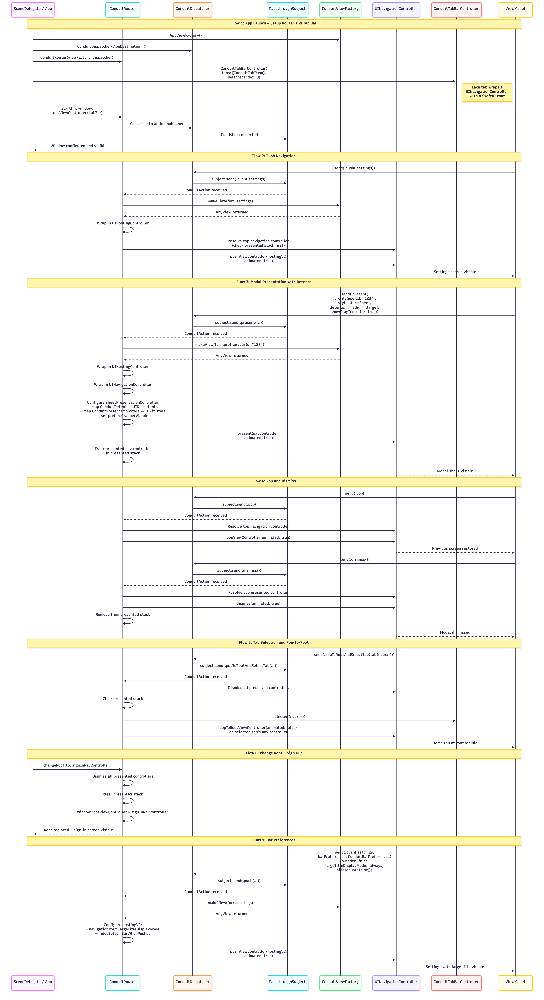

# Conduit

Conduit is a generic, protocol-driven UIKit navigation framework for SwiftUI apps. It uses Combine dispatching, generic destinations, and a centralized router for a type-safe and decoupled navigation API.

> The name **Conduit** comes from engineering — a channel designed to carry something from one point to another with minimal resistance. In your application, Conduit is the pipe through which navigation intent flows: from a view model's decision to a screen appearing on screen. It doesn't decide where to go — it carries the signal, wraps the view, and hands it to UIKit with precision. Like a well-laid conduit in a building's infrastructure, it is invisible when working correctly and indispensable when absent.


```swift
dispatcher.send(.push(.profile(userId: "123")))
```

## Changelog

| Version | Type | Highlights |
|---------|------|-----------|
| **2.0.1** | Patch | Promote `UIViewController.closestNavigationController()` from `internal` to `public` so consumer apps and app extensions can reuse it instead of duplicating the helper. |
| **2.0.0** | Major | Navigation Tracking subsystem (`ConduitNavigationTracker`, events, history, context). New actions: `.openSafari(url)`, `.changeRoot(rootBuilder:, metadata:)`. New detent `.adaptiveHeight` with content measurement. `presentationBackground: Color?` on `.present`. Router walks top-most presenter and defers when mid-transition. `ConduitSheetDetentExpander` utility. **Breaking:** `.present` adds `presentationBackground`; `.popToRootAndSelectTab` adds `reason`. |
| 1.0.3 | Patch | Run main-thread navigation actions synchronously to avoid one-frame push lag. |
| 1.0.2 | Patch | Fix dispatcher binding to init; improve `topViewController` fallback. |
| 1.0.1 | Patch | Fix main actor isolation error in `dismissAllPresentedViewControllers` completion. |
| 1.0.0 | Major | Initial release — generic UIKit navigation framework for SwiftUI apps. |

## Components

### Core Protocols
| Component | What it is |
|-----------|------------|
| `ConduitDestination` | Marker protocol your destination enum conforms to. |
| `ConduitDispatching` | Sends and publishes `ConduitAction` values. |
| `ConduitRouting` | Router lifecycle: `changeRoot`, `updateActiveWindow`. |
| `ConduitViewFactory` | Resolves a destination into a SwiftUI view. |
| `ConduitTabConfiguring` | Supplies the tab items for `ConduitTabBarController`. |

### Domain Models (UIKit-free)
| Component | What it is |
|-----------|------------|
| `ConduitAction<Destination>` | Generic navigation command (`.push`, `.present`, `.pop`, `.dismiss`, `.changeRoot`, `.openSafari`, `.selectTab`, ...). |
| `ConduitBarPreferences` | Navigation-bar visibility, large-title mode, tab-bar hiding. |
| `ConduitDetent` | Sheet detents: `.medium`, `.large`, `.custom`, `.fraction`, `.adaptiveHeight`. |
| `ConduitPresentationStyle` | Modal styles mapped to `UIModalPresentationStyle`. |
| `ConduitLargeTitleDisplayMode` | Large-title preference for pushed and presented screens. |
| `ConduitRootChangeMetadata` | Optional metadata attached to `.changeRoot` for tracker consumers. |
| `ConduitTabItem` | Title + icon + root view + index for a tab bar tab. |

### Infrastructure (UIKit)
| Component | What it is |
|-----------|------------|
| `ConduitDispatcher<Destination>` | Combine `PassthroughSubject`-backed dispatcher. |
| `ConduitRouter<Factory>` | Core engine: translates actions into UIKit transitions, walks the top-most presenter, defers when mid-transition. |
| `ConduitTabBarController` | Generic `UITabBarController` built from a `ConduitTabConfiguring`. |
| `ConduitSheetDetentExpander` | Promote the top-most sheet to `.large` or pin to a custom height. |
| `ConduitWindowUtils` | Active key-window and top-view-controller lookups. |

### Tracking (added in 2.0.0)
| Component | What it is |
|-----------|------------|
| `ConduitNavigatedScreen` | Marker protocol your trackable screen enum conforms to. |
| `ConduitNavigationContext` | Free-form key/value bag attached to every stack entry. |
| `ConduitNavigationEvent<Screen>` | Generic event enum carrying analytics identifiers. |
| `ConduitNavigationHistoryEntry<Screen>` | Single ordered history record. |
| `ConduitNavigationTracking` | Tracker protocol: stacks, history, publishers. |
| `ConduitNavigationTracker<Destination, Screen>` | Concrete generic tracker observing the dispatcher. |

## Features

- **Generic Destinations** -- Define your own destination enum; the router resolves views through your factory.
- **Combine Dispatcher** -- View models send actions; the router subscribes and executes UIKit transitions.
- **Full UIKit Navigation** -- Push, present (sheets, fullscreen, custom detents), pop, dismiss, tab selection, Safari, root swaps.
- **Protocol-Driven** -- Inject `ConduitDispatching`, `ConduitRouting`, `ConduitViewFactory`, and `ConduitNavigationTracking` for full testability.
- **Top-Most Presenter Resolution** -- Walks the `presentedViewController` chain and defers when a presenter is mid-transition, avoiding UIKit's "already presenting" warnings.
- **Adaptive Sheet Heights** -- `ConduitDetent.adaptiveHeight` measures the SwiftUI content at present time and pins the sheet to it.
- **Configurable Tab Bar** -- Generic `ConduitTabBarController` built from `ConduitTabItem` arrays.
- **Navigation Tracking** -- `ConduitNavigationTracker` observes the dispatcher and maintains per-tab stacks, modal stacks, and an analytics-ready history log.
- **UIKit-Free Domain** -- Presentation styles, detents, and bar preferences are SDK enums mapped internally.
- **Swift 6 Ready** -- `@MainActor` isolation, `Sendable` conformance, zero concurrency warnings.
- **Zero Dependencies** -- Built entirely on Combine, UIKit, SwiftUI, and SafariServices.

## Architecture



The diagram illustrates seven navigation flows handled by Conduit's core actors:

| Actor | Role |
|-------|------|
| **SceneDelegate / App** | Entry point that creates the window, router, and tab bar |
| **ConduitRouter** | Central coordinator that subscribes to dispatched actions and executes UIKit transitions |
| **ConduitDispatcher** | Combine-based publisher that view models use to send navigation actions |
| **NavigationController** | UIKit navigation stack resolved by the router for push/pop operations |
| **ConduitViewFactory** | Factory that maps generic destinations to concrete SwiftUI views |
| **UINavigationController** | UIKit host wrapping SwiftUI views via `UIHostingController` |
| **ConduitTabBarController** | Generic tab bar managing multiple navigation stacks and tab selection |
| **ViewModels** | Consumer layer that triggers navigation by sending actions through the dispatcher |

### Flows Covered

| # | Flow | Description |
|---|------|-------------|
| 1 | **App Launch** | Window setup, router start, tab bar configuration, Combine subscription |
| 2 | **Push Navigation** | Dispatcher sends push action, router resolves nav controller, pushes hosting controller |
| 3 | **Modal Presentation** | Present with sheet style, detents, and drag indicator via `present(_:animated:)` |
| 4 | **Pop and Dismiss** | Pop from navigation stack or dismiss presented modals with stack tracking |
| 5 | **Tab Selection and Pop to Root** | Dismiss all presented controllers, pop all stacks, switch selected tab |
| 6 | **Change Root** | Tear down presented stack, replace `window.rootViewController` (e.g., sign-out) |
| 7 | **Bar Preferences** | Configure navigation bar visibility, large title mode, and tab bar hiding per push |

### Source Layout

```
Sources/Conduit/
├── Core/
│   ├── ConduitDestination.swift        ← Marker protocol for app destinations
│   ├── ConduitViewFactory.swift        ← Factory protocol: destination → AnyView
│   ├── ConduitDispatching.swift        ← Dispatcher protocol (Combine publisher)
│   ├── ConduitRouting.swift            ← Router protocol (start, changeRoot)
│   └── ConduitTabConfiguring.swift     ← Tab configuration protocol
├── Domain/
│   ├── ConduitAction.swift             ← Generic navigation commands
│   ├── ConduitBarPreferences.swift     ← Nav bar configuration
│   ├── ConduitDetent.swift             ← Sheet presentation detents
│   ├── ConduitPresentationStyle.swift  ← Modal presentation styles
│   ├── ConduitRootChangeMetadata.swift ← Metadata for .changeRoot actions
│   └── ConduitTabItem.swift            ← Tab item configuration
├── Infrastructure/
│   ├── ConduitDispatcher.swift          ← PassthroughSubject-based dispatcher
│   ├── ConduitRouter.swift             ← Core router: actions → UIKit navigation
│   ├── ConduitTabBarController.swift   ← Generic configurable tab bar
│   ├── ConduitSheetDetentExpander.swift ← Promote top sheet to large / custom height
│   ├── UIViewController+Conduit.swift  ← Navigation controller resolution
│   └── ConduitWindowUtils.swift        ← Active window lookup
└── Tracking/
    ├── ConduitNavigatedScreen.swift              ← Marker protocol for trackable screens
    ├── ConduitNavigationContext.swift            ← Free-form key/value context bag
    ├── ConduitNavigationEvent.swift              ← Generic event enum with analytics IDs
    ├── ConduitNavigationHistoryEntry.swift       ← Single history record
    ├── ConduitNavigationTracking.swift           ← Tracker protocol
    └── ConduitNavigationTracker.swift            ← Concrete generic tracker
```

## Installation

### Swift Package Manager

Add Conduit to your `Package.swift`:

```swift
dependencies: [
    .package(url: "https://github.com/egzonpllana/conduit-ios.git", from: "1.0.0")
]
```

Or in Xcode: **File > Add Package Dependencies** and enter:

```
https://github.com/egzonpllana/conduit-ios.git
```

## Usage

### 1. Define Your Destinations

```swift
import Conduit

enum AppDestination: ConduitDestination {
    case profile(userId: String)
    case settings
    case createPocket(members: [Contact])
}
```

### 2. Implement the View Factory

```swift
struct AppViewFactory: ConduitViewFactory {
    @MainActor
    func makeView(for destination: AppDestination) -> AnyView {
        switch destination {
        case .profile(let userId):
            AnyView(ProfileView(userId: userId))
        case .settings:
            AnyView(SettingsView())
        case .createPocket(let members):
            AnyView(CreatePocketView(members: members))
        }
    }
}
```

### 3. Create Dispatcher and Router

```swift
let dispatcher = ConduitDispatcher<AppDestination>()
let router = ConduitRouter(
    viewFactory: AppViewFactory(),
    dispatcher: dispatcher
)
```

### 4. Start Routing

```swift
func scene(_ scene: UIScene, willConnectTo session: UISceneSession, options: UIScene.ConnectionOptions) {
    guard let windowScene = scene as? UIWindowScene else { return }
    let window = UIWindow(windowScene: windowScene)

    let tabs = [
        ConduitTabItem(title: "Home", icon: homeIcon, rootViewController: homeVC, index: 0),
        ConduitTabItem(title: "Search", icon: searchIcon, rootViewController: searchVC, index: 1),
        ConduitTabItem(title: "Profile", icon: profileIcon, rootViewController: profileVC, index: 2)
    ]
    let tabBar = ConduitTabBarController(tabs: tabs, selectedIndex: 0)

    router.start(in: window, rootViewController: tabBar)
}
```

### 5. Navigate from View Models

```swift
final class ProfileViewModel {
    private let dispatcher: any ConduitDispatching<AppDestination>

    init(dispatcher: any ConduitDispatching<AppDestination>) {
        self.dispatcher = dispatcher
    }

    @MainActor
    func didTapSettings() {
        dispatcher.send(.push(.settings))
    }

    @MainActor
    func didTapContact(userId: String) {
        dispatcher.send(.present(
            .profile(userId: userId),
            style: .formSheet,
            detents: [.medium, .large],
            showDragIndicator: true
        ))
    }

    @MainActor
    func didTapBack() {
        dispatcher.send(.pop)
    }
}
```

### 6. Change Root (Sign Out, Onboarding)

```swift
@MainActor
func signOut(router: any ConduitRouting) {
    let signInVC = UIHostingController(rootView: SignInView())
    let nav = UINavigationController(rootViewController: signInVC)
    router.changeRoot(to: nav)
}
```

### Navigation Actions

| Action | Description |
|--------|-------------|
| `.push(destination)` | Push onto current navigation stack |
| `.present(destination, style:, detents:, presentationBackground:, ...)` | Present modally with sheet configuration and optional background color |
| `.openSafari(url)` | Present `SFSafariViewController` on the top-most presenter |
| `.pop` | Pop top view controller |
| `.popMultiple(count:)` | Pop multiple view controllers |
| `.popToRoot` | Pop to root of current stack |
| `.dismiss()` | Dismiss top presented modal (with top-most-presenter fallback) |
| `.changeRoot(rootBuilder:, metadata:)` | Swap `window.rootViewController`; the closure builds the new root on `MainActor` |
| `.selectTab(index)` | Select a tab bar tab |
| `.popToRootAndSelectTab(tabIndex:, reason:)` | Reset all stacks and select tab |

### Bar Preferences

```swift
// Show navigation bar with large title, keep tab bar visible
dispatcher.send(.push(
    .settings,
    barPreferences: ConduitBarPreferences(
        isHidden: false,
        largeTitleDisplayMode: .always,
        hideTabBar: false
    )
))
```

### Adaptive Sheet Heights

When a sheet should hug its SwiftUI content (e.g., a short form), pass
`.adaptiveHeight`. The router pre-measures the hosting controller via
`sizeThatFits` and substitutes a `.custom` detent before presenting:

```swift
dispatcher.send(.present(
    .quickEditor,
    style: .pageSheet,
    detents: [.adaptiveHeight],
    showDragIndicator: true
))
```

To grow an already-presented sheet (for example, when a text field gains
focus), call `ConduitSheetDetentExpander`:

```swift
ConduitSheetDetentExpander.expandToLarge()
// or pin to a measured height
ConduitSheetDetentExpander.setCustomHeight(420)
```

### Open Safari

```swift
dispatcher.send(.openSafari(URL(string: "https://example.com")!))
```

`ConduitRouter` presents `SFSafariViewController` on the top-most presenter so
it stacks correctly on top of any active modal. Dismiss with the standard
`.dismiss()` action.

### Change Root via Action

`changeRoot` is available both as a direct router method (for cases that need
to pass a window explicitly) and as a `ConduitAction` that flows through the
dispatcher. Using the action lets tracker subscribers see the swap:

```swift
dispatcher.send(.changeRoot(
    rootBuilder: {
        let signIn = UIHostingController(rootView: SignInView())
        return UINavigationController(rootViewController: signIn)
    },
    metadata: .init(
        rootName: "sign_in",
        reason: "user_signed_out",
        resetsTabStacks: false
    )
))
```

## Navigation Tracking

`ConduitNavigationTracker` observes the dispatcher and maintains per-tab
navigation stacks, a modal stack, and a chronological history log keyed by
order. Subscribe to its publishers for analytics, deep-link routing, or
"where is the user right now?" decisions.

### 1. Conform Your Screen Enum

```swift
enum AppScreen: String, ConduitNavigatedScreen {
    case home, feed, settings, profile, eventDetails, unknown

    var analyticsIdentifier: String { rawValue }
}
```

### 2. Create the Tracker

```swift
let tracker = ConduitNavigationTracker<AppDestination, AppScreen>(
    dispatcher: dispatcher,
    initialTabScreens: [
        0: .home,
        1: .feed,
        2: .settings
    ],
    defaultSelectedTabIndex: 1,
    unknownScreen: .unknown,
    resolveScreen: { destination in
        switch destination {
        case .profile: return .profile
        case .eventDetails: return .eventDetails
        default: return .unknown
        }
    },
    resolveContext: { destination in
        switch destination {
        case let .eventDetails(eventId, pocketId):
            return ConduitNavigationContext(values: [
                "eventId": eventId,
                "pocketId": pocketId
            ])
        default:
            return .empty
        }
    },
    analyticsPrefix: "myapp_navigation_"
)
```

### 3. Use the Tracker

```swift
// Forward tab-bar selections from your tab delegate
func tabBarController(_ controller: UITabBarController, didSelect: UIViewController) {
    tracker.trackTabSelection(controller.selectedIndex)
}

// Read current state
let screen = tracker.currentScreen
let depth = tracker.navigationDepth
let isRoot = tracker.isAtRootScreen

// Smart navigation: only push when not already there
if tracker.currentContext["eventId"] != targetEventId {
    dispatcher.send(.push(.eventDetails(eventId: targetEventId, pocketId: pocketId)))
}

// Subscribe to events for analytics
tracker.navigationEventPublisher
    .sink { event in
        analytics.record(name: event.analyticsIdentifier(prefix: "myapp_navigation_"))
    }
    .store(in: &cancellables)

// Query history
let pushes = tracker.navigationEntries(matching: "myapp_navigation_pushed")
let visitsToProfile = tracker.navigationEntries(toScreen: .profile)
```

## API Reference

### Core Protocols

| Protocol | Description |
|----------|-------------|
| `ConduitDestination` | Marker protocol for app-defined navigation destinations |
| `ConduitViewFactory` | Factory that converts destinations to `AnyView` |
| `ConduitDispatching` | Navigation action publisher and sender |
| `ConduitRouting` | Router lifecycle: start, updateWindow, changeRoot |
| `ConduitTabConfiguring` | Tab bar item definition protocol |
| `ConduitNavigatedScreen` | Marker protocol for trackable screen enums |
| `ConduitNavigationTracking` | Tracker protocol: stacks, history, publishers |

### Domain Models

| Type | Description |
|------|-------------|
| `ConduitAction<Destination>` | Generic navigation command enum |
| `ConduitBarPreferences` | Navigation bar visibility and title configuration |
| `ConduitDetent` | Sheet detents: `.medium`, `.large`, `.custom(CGFloat)`, `.fraction(CGFloat)`, `.adaptiveHeight` |
| `ConduitPresentationStyle` | Modal styles: `.pageSheet`, `.formSheet`, `.fullScreen`, `.overFullScreen` |
| `ConduitLargeTitleDisplayMode` | Title modes: `.automatic`, `.always`, `.never` |
| `ConduitRootChangeMetadata` | Optional metadata attached to `.changeRoot` actions |
| `ConduitTabItem` | Tab configuration: title, icon, root view controller, index |

### Infrastructure

| Type | Description |
|------|-------------|
| `ConduitDispatcher<Destination>` | Combine-based `@MainActor` dispatcher |
| `ConduitRouter<Factory>` | Core router translating actions to UIKit navigation |
| `ConduitTabBarController` | Generic tab bar built from `ConduitTabItem` arrays |
| `ConduitSheetDetentExpander` | Promote the top-most sheet to `.large` or a custom height |
| `ConduitWindowUtils` | Active key window lookup |

### Tracking

| Type | Description |
|------|-------------|
| `ConduitNavigationTracker<Destination, Screen>` | Concrete generic tracker observing the dispatcher |
| `ConduitNavigationEvent<Screen>` | Generic event enum (pushed, presented, popped, dismissed, tabSwitched, rootChanged, ...) |
| `ConduitNavigationContext` | Free-form key/value bag attached to each stack entry |
| `ConduitNavigationHistoryEntry<Screen>` | Recorded history row with order, event, timestamp, and analytics ID |

## Requirements

- iOS 16.0+ / macOS 13.0+ (build support)
- Swift 6.0+
- Xcode 16.0+

## License

Conduit is available under the MIT license. See the [LICENSE](LICENSE) file for details.
